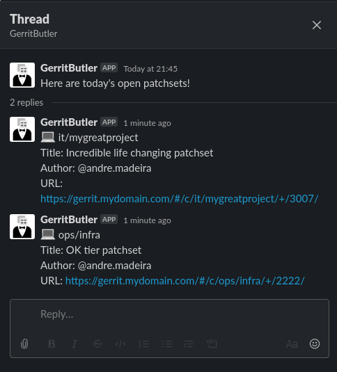

# Gerrit Butler

 Gerrit Butler is a Slack bot. It will post open Gerrit patchsets for you when triggered, based on whatever you configure it to search. It uses Gerrit's API.

<br/><br/>

## Requirements

- A running instance of Gerrit running somewhere
- A Slack workspace
- Python 3.6
- [Requests](https://github.com/psf/requests)
- [Slack Python SDK](https://github.com/slackapi/python-slackclient)

## Configuration example

```
[GERRIT]
URL=https://gerrit.mydomain.com
USERNAME=dummy.user
PASSWORD=super_secret_password

[it/mygreatproject]
OPTIONS=+status:open+is:mergeable+-is:wip

[ops/infra]
OPTIONS=+status:open+-is:wip
```

## Screenshots





